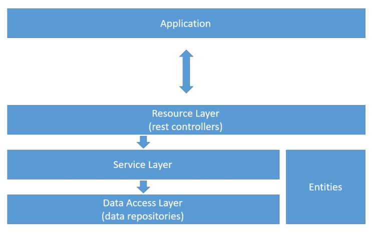
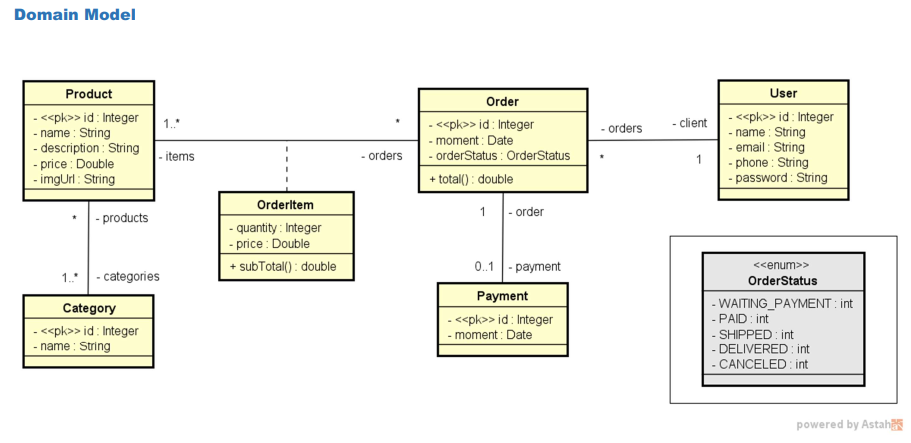
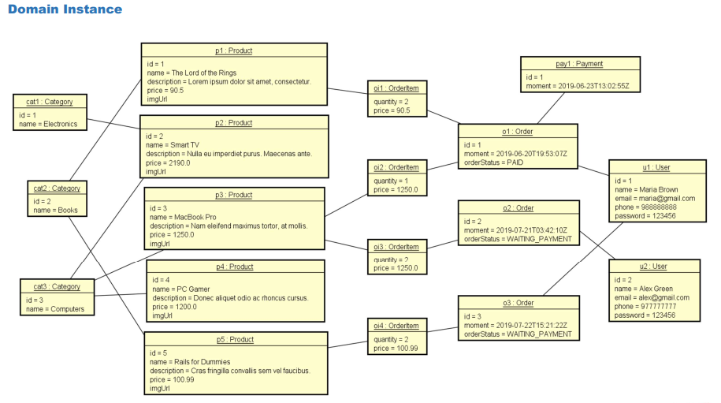
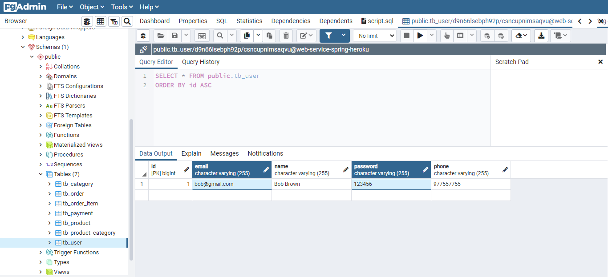
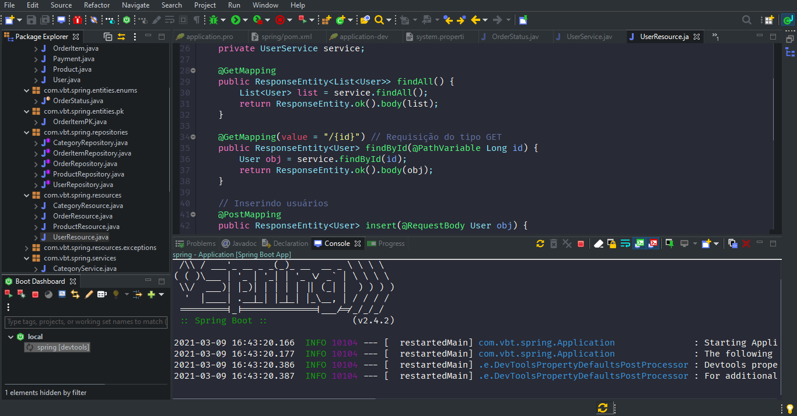
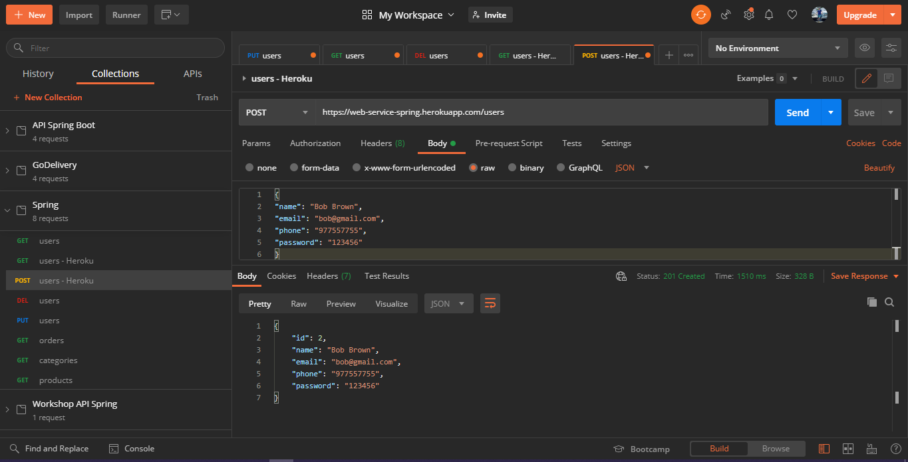
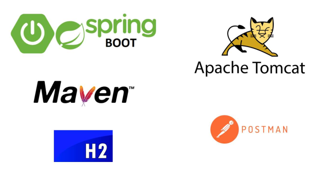

<h1 align="center">
     WEB SERVICE SPRING BOOT JPA / HIBERNATE 1.0 
    Spring Boot | Java | PostgreSQL | Heroku
</h1>

    
    
    

    <a href="#bookmark-About-this-project">About</a>&nbsp;&nbsp;&nbsp;|&nbsp;&nbsp;&nbsp;
    <a href="#rocket-Technologies-used">Technology</a>&nbsp;&nbsp;&nbsp;|&nbsp;&nbsp;&nbsp;
    <a href="#boom-How-to-run">How to run</a>&nbsp;&nbsp;&nbsp;|&nbsp;&nbsp;&nbsp;
    <a href="#memo-License">License</a>

## :bookmark: About this project

The **WEB SERVICE SPRING BOOT JPA / HIBERNATE** project is a small CRM project, where users can place orders, register products and users. The structure is established in Heroku and provisioned in the PostgreSQL database. The backend link on Heroku can be accessed here: https://web-service-spring.herokuapp.com/

## :rocket: Technologies used

- Java version 11
- Spring Boot version 2.4.2
- Maven Version 4.0.0
- PostgreSQL database Version 13

## :wrench: Tools
- Spring Tool Suite 4
- pgAdmin
- Heroku
- Postman

<h4 align="left">Backend Structure</h4>
    

<h4 align="left">Domain Model</h4>
    

<h4 align="left">Domain Instance</h4>
    

<h4 align="left">Database PostgreSQL</h4>
    

<h4 align="left">Spring Tool Suit</h4>
    

<h4 align="left">Checking endpoints with Postman</h4>
    

<h4 align="left">Technology</h4>
    

## :boom: How to run

- ### **Requirements**

  - It is **necessary** to have the Java 11 version installed and with the environment variable properly allocated for operation.
  - It is necessary to have the version of Spring Tool Suit 4 for the project to function properly.
  - For quick endpoint testing, the project has the H2 database and a local PostgreSQL dev base, for which version 13 of PostegreSQL must be installed to work, the bank script is in the database folder. To test the endpoint on the prod base, simply access the project on Heroku: https://web-service-spring.herokuapp.com/
  

## :memo: License

This project is under the MIT license.
